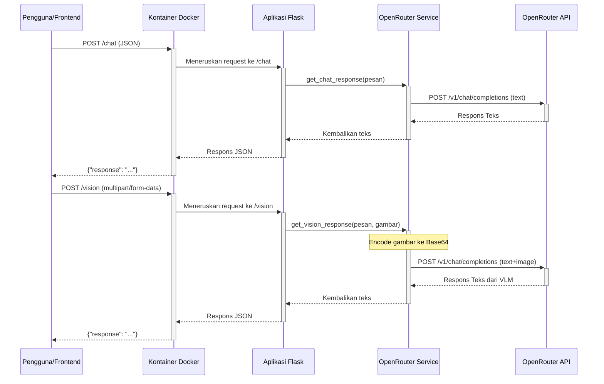

# ai-moneyvesto

## 1. Arsitektur & Alur Sistem

### 1.1. Diagram Alur Permintaan (Request Flow)
Diagram berikut mengilustrasikan alur permintaan untuk endpoint teks (`/chat`) dan vision (`/vision`).



### 1.2. Dokumentasi API

#### Endpoint: `/chat`
Endpoint utama untuk interaksi berbasis teks.

- **URL**: `/chat`
- **Method**: `POST`
- **Headers**:
  - `Content-Type: application/json`
- **Request Body (JSON)**:
  ```json
  {
    "message": "Halo, apa kabar hari ini?"
  }
  ```
- **Contoh Pengujian dengan cURL**:
  ```bash
  curl -X POST http://localhost:{PORT}/chat -H "Content-Type: application/json" -d '{"message": "Ceritakan sebuah lelucon tentang pemrograman."}'
  ```

---

#### Endpoint: `/vision`
Endpoint untuk interaksi yang melibatkan gambar dan teks.

- **URL**: `/vision`
- **Method**: `POST`
- **Headers**:
  - `Content-Type: multipart/form-data`
- **Request Body (Form Data)**:

| Key       | Type   | Description                   | Wajib |
| :-------- | :----- | :---------------------------- | :---- |
| `message` | string | Pesan teks dari pengguna. | Ya    |
| `image`   | file   | File gambar (jpg, png, webp). | Ya    |

- **Respons Sukses (200 OK)**:
  Mengembalikan objek JSON dengan deskripsi atau jawaban dari model AI berdasarkan gambar dan teks.
  ```json
  {
    "response": "Ini adalah gambar seekor anjing golden retriever yang sedang bermain di taman."
  }
  ```
- **Contoh Pengujian dengan cURL**:
  Ganti `path/to/your/image.jpg` dengan path file gambar Anda.
  ```bash
  curl -X POST http://localhost:{PORT}/vision -F "message=Gambar apa ini dan ada berapa objek di dalamnya?" -F "image=@test\image1.jpg"
  ```