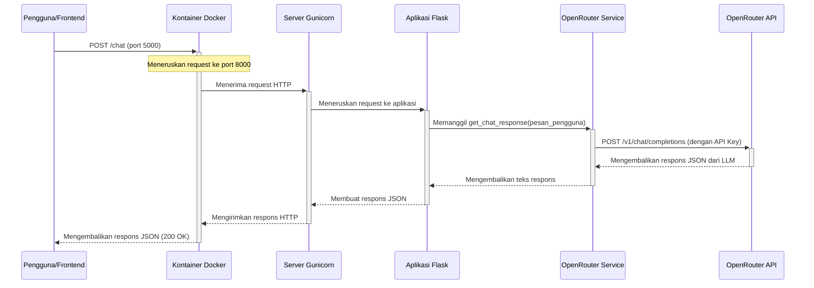

# ai-moneyvesto

## 1. Chatbot



### Dokumentasi API

#### Endpoint: `/chat`
Endpoint utama untuk berinteraksi dengan chatbot.

- **URL**: `/chat`
- **Method**: `POST`
- **Headers**:
  - `Content-Type: application/json`

#### Request Body (JSON):
| Key     | Type   | Description               | Wajib |
|---------|--------|---------------------------|-------|
| message | string | Pesan teks dari pengguna. | Ya    |

**Contoh Request Body**:
```json
{
  "message": "Halo, apa kabar hari ini?"
}
```

#### Respons Sukses (200 OK):
Mengembalikan objek JSON dengan balasan dari model AI.

**Contoh Respons Sukses**:
```json
{
  "response": "Saya baik, terima kasih! Ada yang bisa saya bantu?"
}
```

#### Respons Gagal:
- **400 Bad Request**: Jika `message` kosong di dalam body.
  ```json
  {
    "error": "Pesan tidak boleh kosong"
  }
  ```
- **500 Internal Server Error**: Jika terjadi kesalahan saat berkomunikasi dengan API OpenRouter.
  ```json
  {
    "error": "Gagal terhubung ke layanan OpenRouter."
  }
  ```

#### Contoh Pengujian dengan cURL
Anda bisa menguji endpoint menggunakan `curl` dari terminal Anda.

```bash
curl -X POST http://localhost:5000/chat \
-H "Content-Type: application/json" \
-d '{"message": "Ceritakan sebuah lelucon tentang pemrograman."}'
```